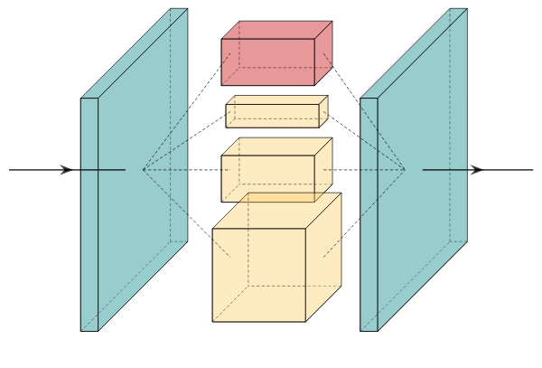

# Inception

Translation invariance is one of the reasons that convolutional networks are so successful at working with images. Inception networks are an attempt at taking that idea and encoding scale invariance into convolutional networks. Rather than choosing a single kernel size at each convolutional layer, why not use several kernel sizes and concatenate their results together.
