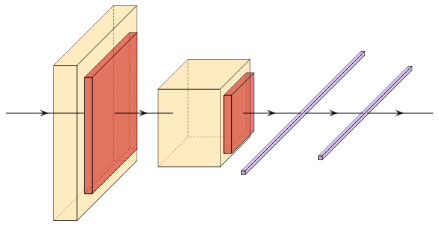

# LeNet

LeNet was one of the first convolutional neural networks, introduced in 1989 by Yann LeCun at Bell Labs, and it has been a foundational piece of work in the field of computer vision. LeNet laid the groundwork for how convolutional architectures will be structured for the next several decades.

LeNet used tanh as the activation functions and two fully connected linear layers following the convolutional/pooling blocks.
