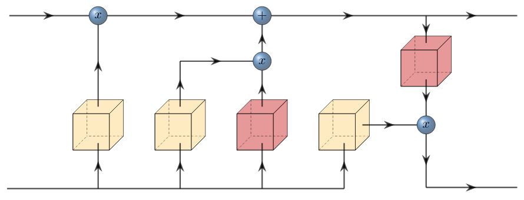

# Long Short-Term Memory (1997)

LSTM networks were introduced by J. Schmidhuber in 1997. LSTMs are a large improvement over the standard recurrent neural network as they enabled a way for better processing of historical data and a kind of solution to the vanishing gradient problem that plagued vanilla RNNs. LSTMs use quite a complex architecture which involves the use of several "gates" that we call the input, output and forget gates. These gates are composed into a "cell" and the composition of them allow for memory over arbitrary time intervals.

$$
f_t = \sigma (W_f x_t + U_f h_{t-1} + b_f) \\
i_t = \sigma (W_i x_t + U_i h_{t-1} + b_i) \\
o_t = \sigma (W_o x_t + U_o h_{t-1} + b_o) \\
\hat{c}_t = tanh (W_c x_t + U_c h_{t-1} + b_c) \\
c_t = f_t \circ c_{t-1} + i_t \circ \hat{c}_t \\
h_t = o_t \circ tanh (c_t)
$$
