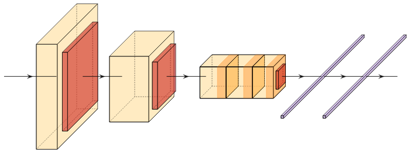

# AlexNet

Deeper + ReLU

AlexNet started the deep learning revolution at a time when the computational capacity of neural networks was limited. At the time, the compute required for deep networks was just infeasible, and the memory available on GPUs was not very much. While the architecture itself is not so revolutionary, and in fact it is very much a variant of LeNet, AlexNet utilized some clever tricks that allowed them to split the network onto two GPUs. AlexNet also popularized a new activation function, ReLU, which will come to be the de-facto standard for deep neural networks until today. ReLU offered an advantage with it's unbounded activation such that deep neural networks would not suffer from the vanishing gradient problem.
