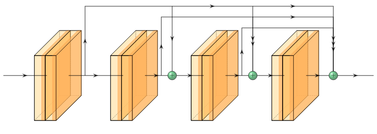

# DenseNet

DenseNet is special for configuration of skip connections between layers. The output of each convolutional layer is passed to every single successive convolutional layer. All of these extra inputs are concatenated together.
