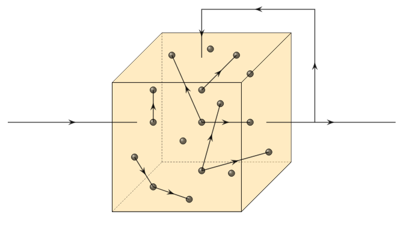

# Echo State Network (2004)

Echo State Networks belong to a class of networks called reservoir computing models. Echo State Networks are composed of a reservoir (or reservoirs in deep variants) that consist of a moderate amount of sparse and randomly connected neurons. The weights and the connections between the neurons are fixed. The output of this reservoir is piped back in to the reservoir in a recurrent fasion. The connectivity of the neuron is initialized such that the spectral radius of the reservoir is less than 1. This property ensures that the recurrent state that is passed back into the reservoir slowly decays over time (like an echo). The reservoir is then passed to fully connected neurons with learned weights. Echo State Networks are very fast and well suited for simplistic series data. The chaotic and cyclical behavior of the reservoir makes it especially suited to time series forecasting.
