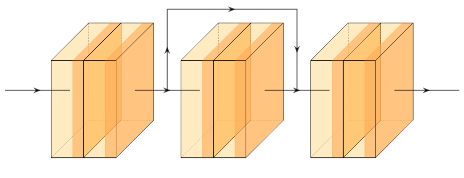

# ResNet

Residual Networks utilize "skip" connections to eliminate the vanishing gradient problem and enable ultra deep neural networks. ResNets are extremely powerful as the extra depth affords more predictive power and the skip connections allows for better optimization of early layers in the network.
