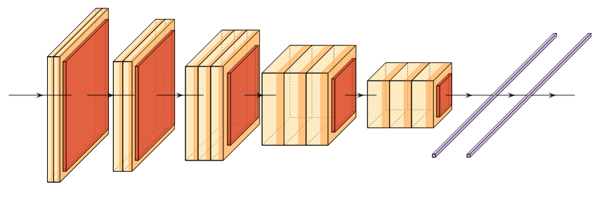

# VGG

VGG, named after the Visual Geometry Group, is probably the canonical example of the first "modern" deep neural network. VGG was wildy successful and they showed that 3c3 kernels were all you needed. Prior to this, networks were typically composed of different size kernels, gradually decreasing as you moved deeper into the network. The composition of stacked layers and 3x3 kernels enabled significantly larger networks and better generalization.
